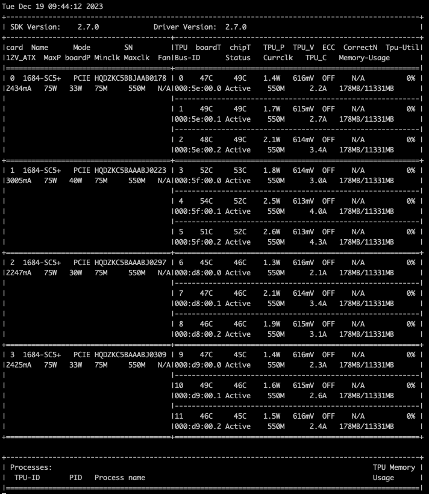

# Uminer

## bm_chip 
### it is developed on c++ driven by sophon chip driver, provided by sophon tech. Burning EFUSE, generation of key pairs, signature of chip are all executed at this module
1. install bm-chip driver from sophon website, all technical information is found here: https://developer.sophgo.com/site/index/material/all/all.html, you may follow instructions to install driver at worker server. \
  All worker servers must be used at Ubuntu/Linux system for adapting the driver \
  For the 1684 chipsets, you need to install SDK v2.7.0 at the Ubuntu server: `wget https://sophon-file.sophon.cn/sophon-prod-s3/drive/22/08/15/09/bmnnsdk2_bm1684_v2.7.0_20220810patched.zip` \
  For the 1684x/1686 chipsets, you need to install SDK v0.5.0: download from `https://oss-file.s3.ap-northeast-1.amazonaws.com/sc7_driver.zip`, and place into the server \
2. After installing driver, you start with the command: "bm-smi" to check the status and information of all chips, shown below\

3. For more details, process about installing the driver and commands, there is  another readme file under ./bm_chip/src/README.md .

4. compile the libraries under the src/ directory:
   * g++ -shared -o libchip.so *.cpp ../bmlib/src/*.cpp ../bmlib/src/linux/*.cpp ../common/bm1684/src/common.c -I../bmlib/include -I../bmlib/src/linux -I../common/bm1684/include -I../config -I/usr/local/opt/openssl/include -L/usr/local/opt/openssl/lib -lssl -lcrypto -fPIC
   * make sure cmake, openssl is all installed at the server
   * This will build a libchip.so at the same directory，providing sdk for golang to request
5. make a copy of libchip.so at local lib :
   * cp ./libchip.so /usr/local/lib/ (or cp ./libchip.so /usr/lib/)

## uminer_server
### it is the server developed on golang to provide grpc and http service, asked by miner app, communicating with utility nodes, base server or container cloud server
1. demo of bm-chip sdk request by golang
* run the chip demo at /cmd/demo, this the demo to show how to burn, generate keys, sign message and verify signature: go build -o ../test, and do next: \
../test start dev_id : start the cpu of the chip, whose id number is dev_id. dev_id is the Bus-ID, like 1, 2, 3, 4 shown in the figure above (if it is not started, the following command will fail)\
../test burn dev_id : burn an AES key of the chip, whose id number is dev_id, at the efuse area, it will give a success message (this command can only be executed once, you are required to restart the server before proceeding the following command)\
../test keygen dev_id : generate p2 and pubkey from the efuse area, stored as two files (this command can only be executed once, the files are kept /bm_chip/src/key)\
../test keyread dev_id : read p2 and pubkey from stored files (this command can be executed multiple times, the result can be upload to blockchain)\
../test sign dev_id : send p2 and a message into the chip to sign a digest(this command can be executed multiple times)\
../test verify dev_id : send signature, message and pubkey to verify its validity(this command can be executed multiple times)\
 (dev_id now is defaulted as 6 for sign and verify, you can keyread the chip 6 8 10)
2. miner server and worker server
* when operating at miner server, under ./miner-server/cmd/miner build the executable file miner: `go build -o ../miner` and run it
 (for the ./miner-server/api/chipApi/burn.go sign.go, replace the function) \
when operating at miner server, under ./miner-server/cmd/worker build the executable file miner: `go build -o ../worker` and run it \
3. json file
* json files are stored at at ./miner-server/cmd/jsonfile, with another readme file explaining the function of each json file. Simply they are used for calling utility nodes grpc method to upload chip information, claim chip computation/stake or sign transaction.